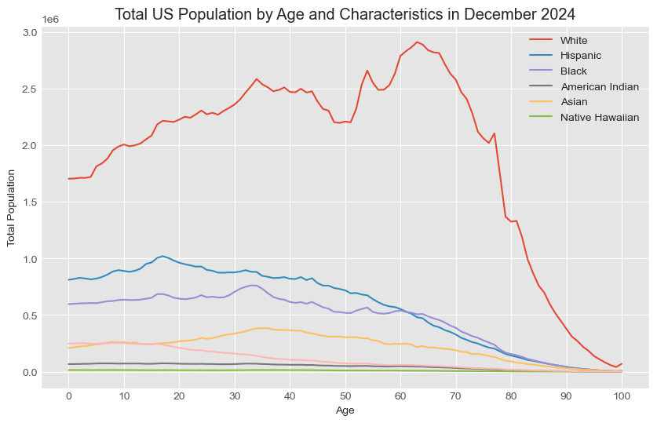

# census
Analysis of census data by race/ethnicity to *update* the 2019 report from the Pew Center on the [most common age among US racial ethnic groups/](https://www.pewresearch.org/short-reads/2019/07/30/most-common-age-among-us-racial-ethnic-groups/), with 2025 figures.

We observe that the most common age in the US in now 65 – the silver wave is coming at us.

I've used this date in my blog post and my bluesky post:
* [Missing millions – Subliminal](http://antoine.wojdyla.fr/blog/2025/01/07/missing-millions/)
* [Antonymous – Bluesky](https://bsky.app/profile/antonymous.bsky.social/post/3lbuprrxg7s2v)

The main component of this repository is the `census.ipynb` notebook.